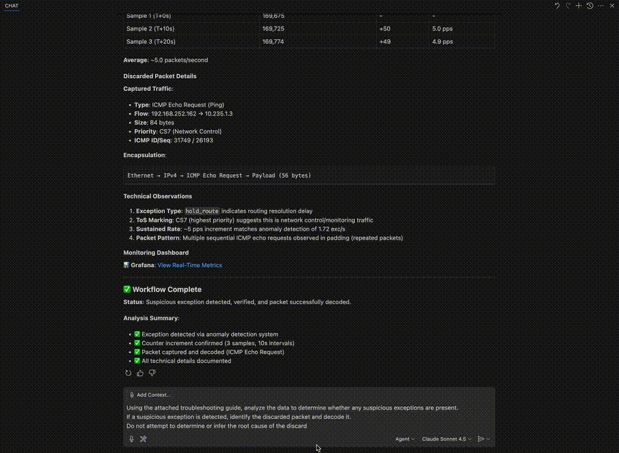

# Observability MCP Server

MCP (Model Context Protocol) server for Juniper network observability with InfluxDB and Grafana integration.



## Overview

This project provides a complete observability stack for Juniper networks:

1. **Data Collection**: Automated collection of PFE exceptions from Juniper devices via Telegraf
2. **Storage**: Time-series data stored in InfluxDB
3. **Visualization**: Grafana dashboards for metrics analysis
4. **AI Integration**: MCP servers enabling AI assistants (Claude Desktop, GitHub Copilot) to:
   - Query metrics using natural language
   - Execute Junos commands directly on devices
   - Debug PFE exceptions with packet captures

**Available MCP Servers:**

### 🔍 Observability MCP (`observability-mcp`)
Network monitoring and anomaly detection tools:
- `query_influx` - Execute Flux queries against InfluxDB for network metrics
- `check_suspicious_exceptions` - Detect PFE exception anomalies with **8 intelligent rules** including ML-based detection ⭐
- `list_dashboards` - List all available Grafana dashboards
- `get_dashboard` - Get details of a specific Grafana dashboard by UID

### ⚙️ Junos MCP (`junos-mcp-server`)
Direct device management and troubleshooting:
- `execute_junos_command` - Execute any Junos CLI command
- `get_junos_config` - Retrieve device configuration
- `junos_config_diff` - Compare configurations
- `gather_device_facts` - Get device hardware/software info
- `get_router_list` - List all configured devices
- `pfe_debug_exceptions` - **Capture and decode discarded packets** 🔥 NEW
- `load_and_commit_config` - Apply configuration changes

---

## Architecture

```
┌──────────────────────────────────────────────────────────────────────────────────┐
│                                CLIENT LAYER                                      │
└──────────────────────────────────────────────────────────────────────────────────┘
              ┌──────────────────┐              ┌──────────────────┐
              │  Claude Desktop  │              │  GitHub Copilot  │
              │                  │              │   (VS Code)      │
              └────────┬─────────┘              └────────┬─────────┘
                       │                                 │
                       │        stdio (JSON-RPC)         │
                       └──────────────┬──────────────────┘
                                      │
┌─────────────────────────────────────┼──────────────────────────────────────────┐
│                                     │            BRIDGE LAYER                  │
│                                     ▼                                          │
│                          ┌─────────────────────┐                               │
│                          │    mcp_bridge.py    │                               │
│                          │   (stdio ↔ HTTP)    │                               │
│                          └──────────┬──────────┘                               │
│                                     │                                          │
│                                     │ HTTP                                     │
└─────────────────────────────────────┼──────────────────────────────────────────┘
                                      │
┌─────────────────────────────────────┼─────────────────────────────────────────┐
│                                     │          MCP SERVER LAYER               │
│                                     │                                         │
│     ┌───────────────────────────────┼───────────────────────────────┐         │
│     │  Observability MCP            │  Junos MCP                    │         │
│     │  [Docker: mcp]                │  [Docker: junos-mcp]          │         │
│     │                               │                               │         │
│     │  ┌──────────┐  ┌───────────┐  │ ┌────────────────────┐        │         │
│     │  │ server.py│  │  api.py   │  │ │     jmcp.py        │        │         │
│     │  │ (MCP3334)│  │ (REST3333)│  │ │ (HTTP MCP30030)    │        │         │
│     │  └────┬─────┘  └─────┬─────┘  │ └──────────┬─────────┘        │         │
│     │       │              │        │            │                  │         │
│     │       ▼              ▼        │            ▼                  │         │
│     │  ┌────────────┐               │ ┌────────────────────-┐       │         │
│     │  │   tools/   │               │ │  PyEZ + Paramiko    │       │         │
│     │  │            │               │ │                     │       │         │
│     │  │ • influx   │               │ │ • execute_command   │       │         │
│     │  │ • grafana  │               │ │ • get_config        │       │         │
│     │  │            │               │ │ • gather_facts      │       │         │
│     │  │ [4 tools]  │               │ │ • pfe_debug         │       │         │
│     │  └─────┬──────┘               │ │ [7 tools]           │       │         │
│     └────────┼─────────────────────-┘ └──────────-┬─────────┘       │         │
│              │                                    │                 │         │
│              │ HTTP APIs                          │ SSH / NETCONF   │         │
└──────────────┼────────────────────────────────────┼─────────────────┘         │
               │                                    │                           │
    ┌──────────┴───────────┐                        ▼────────────┐              │
    │                      │                                     │              │
    ▼                      ▼                                     ▼              │
┌─────────────┐    ┌─────────────┐               ┌────────────────────┐         │
│  InfluxDB   │◄───│  Telegraf   │               │  Juniper Devices   │         │
│   :8086     │    │ (Collector) │               │                    │         │
│             │    │ Python      │               │ • router1          │         │
│    Metrics  │    │ SSH         │               │ • router2          │         │
│ [Docker]    │    │ [Docker]    │               │ • MX960 / MX480    │         │
│             │    │             │               │                    │         │
│ Volumes:    │    └──────▲──────┘               │ SSH :22            │         │
│ • data      │           │                      │ NETCONF :830       │         │
│ • config    │           │                      └────────────────────┘         │
└─────┬───────┘           │                                                     │
      │                   │ Data Collection (PFE exceptions)                    │
      ▼                   │                                                     │
┌─────────────┐           │                                                     │
│  Grafana    │───────────┘                                                     │
│   :3000     │                                                                 │
│ Dashboards  │                                                                 │
│ [Docker]    │                                                                 │
│ Volumes:    │                                                                 │
│ • grafana   │                                                                 │
└─────────────┘                                                                 │
└───────────────────────────────────────────────────────────────────────────────┘

```

### Component Breakdown

**AI Integration Layer:**
- **Observability MCP** - Metrics analysis and anomaly detection
- **Junos MCP** - Direct device access and troubleshooting

**Data Collection (Docker):**
- **Telegraf Collector** - Collects PFE exceptions every 60s via SSH

**Storage & Visualization (Docker):**
- **InfluxDB** (port 8086) - Time-series database
- **Grafana** (port 3000) - Dashboard visualization

---

## Anomaly Detection System Architecture

The `check_suspicious_exceptions` tool uses a sophisticated multi-layered anomaly detection system that combines **dynamic baselines**, **statistical analysis**, and **machine learning** to identify suspicious PFE exception patterns with high accuracy and minimal false positives.

### Detection Pipeline

```
┌─────────────────────────────────────────────────────────────────────────┐
│                         DATA INGESTION                                  │
│  InfluxDB ← Telegraf ← Juniper Devices (PFE exception counters @ 60s)   │
└────────────────────────────────┬────────────────────────────────────────┘
                                 │
                                 ▼
┌─────────────────────────────────────────────────────────────────────────┐
│                    DYNAMIC BASELINE CALCULATION                         │
│                                                                         │
│  ┌──────────────┐  ┌───────────────┐  ┌──────────────┐                  │
│  │ Short Window │  │ Medium Window │  │ Long Window  │                  │
│  │   (2 hours)  │  │   (24 hours)  │  │  (7 days)    │                  │
│  └──────┬───────┘  └───────┬───────┘  └──────┬───────┘                  │
│         │                  │                  │                         │
│         └──────────────────┼──────────────────┘                         │
│                            ▼                                            │
│                   Context-Aware EWMA                                    │
│                   (Time of Day, Day of Week)                            │
│                            │                                            │
│                            ▼                                            │
│                   Adaptive Weight Calculation                           │
│                   (Quality-based: sample count, stability)              │
│                            │                                            │
│                            ▼                                            │
│                    Final Dynamic Baseline                               │
└────────────────────────────────┬───────────────────────────────────────-┘
                                 │
                                 ▼
┌─────────────────────────────────────────────────────────────────────────┐
│                      ANOMALY DETECTION ENGINE                           │
│                                                                         │
│  ┌────────────────────────────────────────────────────────────┐         │
│  │              STATISTICAL RULES (Rules 1-7)                 │         │
│  │                                                            │         │
│  │  Rule 1: New Exception (0 → ≥1 exc/s)                      │         │
│  │  Rule 2: Spike Detection (2x baseline)                     │         │
│  │  Rule 3: Sustained Change (1.5x baseline, persistent)      │         │
│  │  Rule 4: Weekly Anomaly (same time/day deviation)          │         │
│  │  Rule 5: Rate of Change (acceleration detection)           │         │
│  │  Rule 6: Volatility (coefficient of variation)             │         │
│  │  Rule 7: Multi-Exception Correlation (≥3 exceptions)       │         │
│  └────────────────────────────────────────────────────────────┘         │
│                                                                         │
│  ┌────────────────────────────────────────────────────────────┐         │
│  │         MACHINE LEARNING LAYER (Rule 8)                    │         │
│  │                                                            │         │
│  │  Feature Extraction (6 features):                          │         │
│  │    • Current value                                         │         │
│  │    • Short-term MA (5 samples)                             │         │
│  │    • Long-term MA (20 samples)                             │         │
│  │    • Volatility (std dev)                                  │         │
│  │    • Rate of change                                        │         │
│  │    • Distance from mean                                    │         │
│  │         │                                                  │         │
│  │         ▼                                                  │         │
│  │  Isolation Forest Algorithm                                │         │
│  │    (100 trees, contamination=0.1)                          │         │
│  │         │                                                  │         │
│  │         ▼                                                  │         │
│  │  Anomaly Score (0.0 - 1.0)                                 │         │
│  │    Score > 0.6 = ANOMALY                                   │         │
│  └────────────────────────────────────────────────────────────┘         │
└────────────────────────────────┬───────────────────────────────────────-┘
                                 │
                                 ▼
┌─────────────────────────────────────────────────────────────────────────┐
│                      RESULT AGGREGATION                                 │
│                                                                         │
│  • Deduplicate alerts (same device/exception)                           │
│  • Assign severity (CRITICAL/HIGH/MEDIUM/LOW)                           │
│  • Generate explanation (why anomalous?)                                │
│  • Create Grafana dashboard links                                       │
│  • Sort by severity + timestamp                                         │
└────────────────────────────────┬───────────────────────────────────────-┘
                                 │
                                 ▼
┌─────────────────────────────────────────────────────────────────────────┐
│                         OUTPUT TO USER                                  │
│                                                                         │
│  Device | Exception | Severity | Rule | Details | Dashboard Link        │
└─────────────────────────────────────────────────────────────────────────┘
```

---

### Dynamic Baseline System

Unlike static thresholds, our system calculates **context-aware baselines** that adapt to network behavior patterns:

#### **Multi-Window Analysis**
The system analyzes three overlapping time windows to capture different behavior patterns:
- **Short-term (2 hours)**: Recent immediate behavior
- **Medium-term (24 hours)**: Daily patterns and cycles  
- **Long-term (168 hours / 7 days)**: Weekly patterns and trends

#### **Context-Aware Calculations**
Baselines are computed based on contextual factors:
- **Time of Day**: Network traffic patterns vary significantly between peak hours (daytime) and off-peak (night)
- **Day of Week**: Weekday patterns differ from weekends
- **Regime Detection**: Automatically detects and adapts to significant operational changes

#### **Exponentially Weighted Moving Average (EWMA)**
The system uses EWMA with adaptive weighting:
- **Recent data weighted higher**: More responsive to genuine changes
- **Alpha parameter (α = 0.3)**: Balances responsiveness vs. stability
- **Formula**: `EWMA_t = α × value_t + (1 - α) × EWMA_{t-1}`

#### **Adaptive Quality-Based Weighting**
Final baseline is a weighted combination based on data quality:
```
baseline = w_short × short_baseline + w_medium × medium_baseline + w_long × long_baseline

where: w_short + w_medium + w_long = 1.0
```

**Weight calculation factors**:
- Sample count (more samples = higher weight)
- Data stability (lower variance = higher weight)
- Recency (recent windows weighted higher)
- Time period relevance (weekend vs. weekday)

#### **Benefits**
✅ **No manual threshold tuning** - Automatically adapts to each device's normal behavior  
✅ **Handles seasonal patterns** - Weekly and daily cycles are normalized  
✅ **Reduces false positives** - Context-aware baselines prevent alerts on expected variations  
✅ **Detects regime changes** - Identifies when "normal" behavior fundamentally shifts

---

### Detection Rules (8 Total)

The system employs **8 complementary detection rules** that analyze different aspects of exception behavior. Each rule targets specific anomaly patterns:

#### **Rule 1: New Exception Detection** (Severity: HIGH)
**Pattern**: Exception type transitions from zero to sustained non-zero rate

**Logic**:
- Historical baseline = 0 exc/s
- Current rate ≥ 1 exc/s for multiple consecutive samples (default: 3)
- Indicates a **completely new problem** that didn't exist before

**Use Case**: Detects newly introduced issues from:
- Configuration changes
- New traffic patterns
- Software bugs
- Hardware failures just starting to manifest

**Example**:
```
Device: router1
Exception: sw_error
Baseline: 0.0 exc/s → Current: 2.5 exc/s
Rule: Rule 1 (New exception detected)
Severity: HIGH
```

---

#### **Rule 2: Spike Detection** (Severity: CRITICAL)
**Pattern**: Sudden sharp increase compared to 2-day historical baseline

**Logic**:
- Uses 48-hour lookback for robust baseline
- Triggers when: `current_rate > baseline × threshold`
- Default thresholds:
  - **2x baseline** = CRITICAL
  - **1.5x baseline** = HIGH

**Statistical approach**:
- Calculates mean and standard deviation over 2 days
- Uses percentile-based thresholds (e.g., 95th percentile)
- Filters out transient noise

**Use Case**: Identifies sudden anomalies:
- DDoS attacks triggering firewall discards
- Routing loops causing packet drops
- Hardware malfunction causing exception storms

**Example**:
```
Device: router2
Exception: firewall_discard
Baseline: 10.2 exc/s → Current: 35.7 exc/s (250% increase)
Rule: Rule 2 (Spike vs 2-day baseline)
Severity: CRITICAL
```

---

#### **Rule 3: Sustained Behavior Change** (Severity: MEDIUM)
**Pattern**: Persistent elevation above normal levels (not just a brief spike)

**Logic**:
- Compares current rate to dynamic baseline (multi-window)
- Requires sustained elevation for `min_consecutive_samples` (default: 3)
- Threshold: `current_rate > baseline × 1.5`

**Difference from Rule 2**:
- Rule 2 = **Sharp spike** (immediate, dramatic)
- Rule 3 = **Gradual increase** or **sustained elevation** (persistent but not dramatic)

**Use Case**: Detects gradual degradation:
- Slow memory leaks
- Increasing ARP resolution failures
- Gradual routing table instability

**Example**:
```
Device: router3
Exception: hold_route
Baseline: 5.0 exc/s → Current: 8.5 exc/s (+70%)
Rule: Rule 3 (Sustained behavior change)
Severity: MEDIUM
Duration: 15 minutes sustained
```

---

#### **Rule 4: Weekly Baseline Anomaly** (Severity: MEDIUM)
**Pattern**: Current behavior deviates from same time/day last week

**Logic**:
- Compares current rate to 168-hour (7-day) baseline
- Accounts for **weekly patterns** (e.g., Monday morning traffic vs. Sunday night)
- Threshold: `current_rate > weekly_baseline × 2.0`

**Why 7 days?**
- Networks often have weekly cycles (business days vs. weekends)
- Comparing Monday to Monday is more meaningful than Monday to Sunday

**Use Case**: Detects deviations from established weekly patterns:
- Unusual weekend traffic
- Unexpected daytime drops

**Example**:
```
Device: router4
Exception: unknown_iif
Weekly baseline (Mon 10am): 2.0 exc/s
Current (Mon 10am): 5.5 exc/s (+175%)
Rule: Rule 4 (Weekly baseline anomaly)
Severity: MEDIUM
```

---

#### **Rule 5: Rapid Rate of Change** (Severity: HIGH)
**Pattern**: Exception rate is accelerating dangerously fast

**Logic**:
- Calculates **first derivative** (rate of change) of exception rate
- Compares to historical rate-of-change baseline
- Triggers on: `|current_change| > baseline_change × threshold`

**Mathematical approach**:
```
rate_of_change = (rate_t - rate_{t-1}) / time_delta
acceleration = rate_of_change - baseline_rate_of_change
```

**Use Case**: Early warning for rapidly escalating issues:
- Exponential growth patterns
- Cascading failures
- Runaway processes before they peak

**Example**:
```
Device: router5
Exception: egress_pfe_unspecified
Rate progression: 1 → 3 → 9 → 27 exc/s (exponential)
Rate of change: +8.67 exc/s per minute
Baseline change: +0.5 exc/s per minute
Rule: Rule 5 (Rapid acceleration detected)
Severity: HIGH
```

---

#### **Rule 6: Volatility / Instability Detection** (Severity: MEDIUM)
**Pattern**: Exception rate is highly erratic and unstable

**Logic**:
- Calculates **coefficient of variation (CV)**: `CV = std_dev / mean`
- High CV indicates unstable, unpredictable behavior
- Threshold: `CV > 1.5` (standard deviation exceeds 150% of mean)

**Why it matters**:
- Stable exceptions (e.g., constant 10 exc/s) = **predictable, possibly normal**
- Volatile exceptions (e.g., 1, 50, 2, 40 exc/s) = **unstable, likely problematic**

**Use Case**: Identifies flapping or intermittent issues:
- Route flapping causing intermittent drops
- Intermittent hardware failures
- Unstable BGP sessions

**Example**:
```
Device: router6
Exception: discard_route
Rate samples: [2, 45, 1, 38, 5, 42, 3, 40]
Mean: 22 exc/s, Std Dev: 19.5
Coefficient of Variation: 0.89 (HIGH)
Rule: Rule 6 (High volatility detected)
Severity: MEDIUM
```

---

#### **Rule 7: Multi-Exception Correlation** (Severity: HIGH)
**Pattern**: Multiple different exception types anomalous simultaneously on same device

**Logic**:
- Tracks anomalies across **all exception types** per device
- Triggers when ≥ 3 different exceptions are anomalous at the same time
- Indicates **systemic device problem** rather than isolated issue

**Correlation analysis**:
- Groups anomalies by device and time window
- Identifies common root causes affecting multiple subsystems

**Use Case**: Detects systemic failures:
- FPC/PFE hardware failure affecting multiple packet types
- Memory exhaustion impacting multiple functions
- Software bug affecting multiple processing paths

**Example**:
```
Device: router7
Anomalous exceptions (within 5 minutes):
  - hold_route: 15 exc/s (baseline: 2)
  - firewall_discard: 50 exc/s (baseline: 10)
  - sw_error: 3 exc/s (baseline: 0)
  - unknown_iif: 8 exc/s (baseline: 1)

Rule: Rule 7 (4 correlated exceptions)
Severity: HIGH
Likely cause: Systemic device issue (check FPC health)
```

---

#### **Rule 8: ML-Based Anomaly Detection** (Severity: MEDIUM) 🤖
**Pattern**: Multivariate anomaly detected using machine learning

**Algorithm**: **Isolation Forest** (unsupervised learning)
- No training data required - learns normal behavior from recent history
- Identifies outliers in multi-dimensional feature space
- Contamination parameter: 0.1 (expects 10% of data to be anomalies)

**Feature Engineering** (6 features per data point):
1. **Current value**: Raw exception rate
2. **Short-term MA (5 samples)**: Recent trend
3. **Long-term MA (20 samples)**: Longer-term trend  
4. **Volatility (5-sample std dev)**: Recent stability
5. **Rate of change**: First derivative (momentum)
6. **Distance from mean**: Deviation from center

**How Isolation Forest Works**:
- Builds random decision trees to isolate anomalies
- Anomalies are easier to isolate (fewer splits needed)
- Anomaly score: 0.0 (normal) to 1.0 (strong anomaly)
- Threshold: score > 0.6 = anomaly

**Advantages**:
- ✅ Detects **complex multi-dimensional patterns** that rule-based systems miss
- ✅ No manual tuning - learns automatically from data
- ✅ Handles **non-linear relationships** between features
- ✅ Robust to outliers in training data

**Use Case**: Catches subtle anomalies that don't fit simple rules:
- Unusual combinations of rate + volatility + trend
- Patterns that are "weird" but not easily described by thresholds
- Early detection of novel issues

**Example**:
```
Device: router8
Exception: hold_route
Current rate: 12 exc/s (not dramatic)
BUT ML features show anomaly:
  - Rate: 12 exc/s
  - Short MA: 8 exc/s
  - Long MA: 5 exc/s  
  - Volatility: 4.5 (high)
  - Rate of change: +2 exc/s/min (accelerating)
  - Distance from mean: 2.3 std devs

ML Anomaly Score: 0.78 (HIGH)
Rule: Rule 8 (ML-based multivariate anomaly)
Severity: MEDIUM
Reason: Unusual combination of moderate rate + high volatility + acceleration
```

**Minimum Requirements**:
- Requires ≥ 20 historical samples for training
- Automatically skips ML detection if insufficient data

---

### Configuration & Tuning

The anomaly detection system can be customized through several parameters:

#### **Baseline Calculation Parameters**

Located in `mcp/tools/baseline_manager.py`:

```python
# Time windows for baseline calculation
BASELINE_WINDOWS = {
    'short': timedelta(hours=2),    # Recent behavior
    'medium': timedelta(hours=24),  # Daily patterns
    'long': timedelta(hours=168)    # Weekly patterns
}

# EWMA smoothing parameter
ALPHA = 0.3  # Balance between responsiveness (higher) and stability (lower)

# Minimum samples required for reliable baseline
MIN_SAMPLES = {
    'short': 5,   # At least 5 samples in 2h window
    'medium': 10, # At least 10 samples in 24h window  
    'long': 20    # At least 20 samples in 7d window
}
```

**Tuning Guidelines**:
- **Increase ALPHA** (e.g., 0.5) for faster adaptation to changes → More responsive but less stable
- **Decrease ALPHA** (e.g., 0.1) for smoother baselines → More stable but slower to adapt
- **Adjust BASELINE_WINDOWS** for different network patterns (e.g., 48h medium for specific use cases)

#### **ML Detection Parameters**

Located in `mcp/tools/ml_detector.py`:

```python
# Isolation Forest configuration
CONTAMINATION = 0.1  # Expected proportion of anomalies (10%)
N_ESTIMATORS = 100   # Number of trees in the forest
MAX_SAMPLES = 256    # Samples used per tree

# Feature engineering
SHORT_MA_WINDOW = 5   # Short-term moving average window
LONG_MA_WINDOW = 20   # Long-term moving average window
VOLATILITY_WINDOW = 5 # Volatility calculation window

# Anomaly threshold
ANOMALY_SCORE_THRESHOLD = 0.6  # Score > 0.6 = anomaly (0.0-1.0 scale)

# Minimum data requirement
MIN_SAMPLES_FOR_ML = 20  # Need at least 20 historical points
```

**Tuning Guidelines**:
- **Increase CONTAMINATION** (e.g., 0.15) if getting too few alerts → More sensitive
- **Decrease CONTAMINATION** (e.g., 0.05) if getting too many false positives → More selective
- **Adjust ANOMALY_SCORE_THRESHOLD** (0.5-0.7) to balance sensitivity vs. precision
- **Increase N_ESTIMATORS** (e.g., 150) for more stable predictions but slower processing

#### **Rule-Specific Thresholds**

Located in `mcp/tools/influx.py` (check_suspicious_exceptions function):

```python
# Rule 2: Spike detection
SPIKE_THRESHOLD_CRITICAL = 2.0  # 2x baseline = CRITICAL
SPIKE_THRESHOLD_HIGH = 1.5      # 1.5x baseline = HIGH

# Rule 3: Sustained behavior change  
SUSTAINED_THRESHOLD = 1.5       # 1.5x baseline

# Rule 4: Weekly baseline anomaly
WEEKLY_THRESHOLD = 2.0          # 2x weekly baseline

# Rule 5: Rate of change
ROC_THRESHOLD = 2.0             # 2x historical rate of change

# Rule 6: Volatility
CV_THRESHOLD = 1.5              # Coefficient of variation > 1.5

# Rule 7: Multi-exception correlation
MIN_CORRELATED_EXCEPTIONS = 3   # At least 3 different exceptions
```

---

### Operational Considerations

#### **Cold Start Problem**
When first deploying, the system has no historical data:
- **First 2 hours**: Only Rules 1, 2, 6 are active (don't require long history)
- **After 24 hours**: Rules 3, 5 become active (need medium-term baseline)
- **After 7 days**: Rule 4 becomes fully effective (weekly comparison)
- **Rule 8 (ML)**: Active after 20+ samples (typically 20+ minutes)

**Recommendation**: Seed with 7 days of historical data before relying on all rules.

#### **Performance Impact**
- **Baseline calculation**: O(n) where n = number of samples in windows (~few thousand)
- **ML detection**: O(n × log n) for Isolation Forest (~100-500ms per device)
- **Total latency**: Typically < 2 seconds for analysis of 10 devices

#### **Memory Usage**
- Baseline manager caches: ~10 MB per device (7 days of data)
- ML detector: ~5 MB per model (one model per device/exception pair)
- Total: ~100 MB for 10 devices with 5 exception types each

---

### Rule Severity Matrix

| Rule | Name | Severity | False Positive Rate | Best For |
|------|------|----------|---------------------|----------|
| 1 | New Exception | HIGH | Very Low | New issues |
| 2 | Spike Detection | CRITICAL | Low | Sudden problems |
| 3 | Sustained Change | MEDIUM | Medium | Gradual degradation |
| 4 | Weekly Baseline | MEDIUM | Medium | Pattern deviation |
| 5 | Rate of Change | HIGH | Low | Escalating issues |
| 6 | Volatility | MEDIUM | Medium | Flapping/instability |
| 7 | Multi-Exception | HIGH | Very Low | Systemic failures |
| 8 | ML-Based | MEDIUM | Low | Complex patterns |

---

### Why Multiple Rules?

**Complementary Coverage**:
- Different anomaly types require different detection approaches
- No single rule catches all problems
- Multiple rules provide **cross-validation** (if 2+ rules trigger, confidence is higher)

**Reduced False Positives**:
- Rules have different sensitivity profiles
- Context-aware baselines adapt to normal variations
- ML layer catches edge cases

**Actionable Insights**:
- Rule type indicates **nature of the problem**
- Helps prioritize investigation
- Provides troubleshooting hints

---

## Quick Start Guide

### Step 1: Configure Juniper Device Access

Edit device configurations:

```bash
# For Telegraf collector
cd collector/data
nano credentials.yaml  # Add SSH credentials
nano routers.yaml      # Add device hostnames

# For Junos MCP server
cd ../../mcp-junos
nano devices.json      # Add devices with full details
```

**Example `devices.json`:**
```json
{
  "router1": {
    "ip": "10.10.20.1",
    "port": 22,
    "username": "jncie",
    "password": "jncie123"
  },
  "router2": {
    "ip": "10.10.20.3",
    "port": 22,
    "username": "jncie",
    "password": "jncie123"
  }
}
```

### Step 2: Start All Services

```bash
docker-compose up -d
```

This starts:
- ✅ InfluxDB (port 8086)
- ✅ Grafana (port 3000)
- ✅ Telegraf collector
- ✅ Observability MCP server (port 3333/3334)
- ✅ Junos MCP server (port 30030)

Verify:
```bash
docker-compose ps
# Should show: influxdb, grafana, mcp, collector, junos-mcp-server
```


### Step 3: Configure AI Client

#### VS Code + GitHub Copilot (Recommended)

Create global MCP configuration:

```bash
mkdir -p ~/.vscode
cat > ~/.vscode/mcp-servers.json << 'EOF'
{
  "mcpServers": {
    "observability-mcp": {
      "command": "python3",
      "args": ["/home/ubuntu/openntIA/mcp/mcp_bridge.py"],
      "env": {
        "MCP_SERVER_URL": "http://localhost:3333"
      }
    },
    "junos-mcp-server": {
      "url": "http://127.0.0.1:30030/mcp/",
      "transport": {
        "type": "http"
      }
    }
  }
}
EOF
```

**Reload VS Code**: `Ctrl+Shift+P` → "Developer: Reload Window"

**Verify Tools**: Click 🔨 icon in Copilot Chat sidebar - you should see **11 tools** total.

---

## Complete Troubleshooting Workflow

### 🎯 End-to-End Example: Detect and Debug PFE Exception

This workflow demonstrates the power of combining both MCP servers:

#### **Step 1: Detect Suspicious Exceptions**

Ask Copilot:
```
"Detect suspicious exceptions in the last hour"
```

**Tool Used**: `check_suspicious_exceptions` (Observability MCP)

**Example Output**:
```
🚨 Suspicious Exception Detected!
- Device: router2
- Exception: hold_route
- Severity: MEDIUM
- Rate: 1.72 exc/s (+51% above baseline)
- Rule: Rule 3 (Sustained behavior change)
- Grafana: [View Dashboard]
```

#### **Step 2: Get Device Details**

Ask Copilot:
```
"Show me the Junos version of router2"
```

**Tool Used**: `execute_junos_command` (Junos MCP)

**Example Output**:
```
Hostname: router2
Model: MX960
Junos: 22.4X4.11
```

#### **Step 3: Verify Exception is Active**

Ask Copilot:
```
"Show me current PFE exception statistics on router2 slot 0"
```

**Tool Used**: `execute_junos_command` (Junos MCP)

**Command Executed**: `show pfe statistics exceptions fpc 0`

**Example Output**:
```
hold route DISC(70)    170,720 packets
```

#### **Step 4: Capture and Decode Discarded Packet** 🔥

Ask Copilot:
```
"Capture and decode the discarded packets for hold_route exception on router2"
```

**Tool Used**: `pfe_debug_exceptions` (Junos MCP)

**What Happens**:
1. Connects to device via SSH (Paramiko)
2. Enables PFE exception debugging: `debug jnh exceptions 70 discard`
3. Waits 2 seconds to capture packets
4. Disables debug: `no debug jnh exceptions 70 discard`
5. Retrieves output: `show jnh exceptions-trace fpc0`
6. Decodes packet using Scapy

**Example Output**:
```
📦 Decoded Packet:

Type: ICMP Echo Request (Ping)
Source: 192.168.252.162
Destination: 10.235.1.3
Protocol: ICMP (Type 8, Code 0)
Size: 84 bytes
TTL: 64 hops
ToS: 224 (CS7 / Network Control)

Packet Layers:
├─ Ethernet
│   ├─ dst: 2c:6b:f5:f2:67:c5
│   ├─ src: 2c:6b:f5:4d:ce:c6
│   └─ type: IPv4
├─ IPv4
│   ├─ src: 192.168.252.162
│   ├─ dst: 10.235.1.3
│   └─ proto: ICMP
└─ ICMP Echo Request
    ├─ id: 31749
    └─ seq: 27391

Exception: hold_route (DISC 70)
Reason: Packet destined to IP without resolved next-hop
```

#### **Step 5: Root Cause Analysis**

Ask Copilot:
```
"Show me the routing table for 10.235.1.3 on router2"
```

**Tool Used**: `execute_junos_command` (Junos MCP)

**Command**: `show route 10.235.1.3`

Based on the output, you can determine if:
- Route is missing
- Next-hop is down
- ARP resolution failed
- Routing policy is blocking

---

## Usage Examples by Category

### 🔍 Network Monitoring (Observability MCP)

```
"Detect suspicious exceptions in the last hour"
"Show me devices with sw_error exceptions"
"Are there any critical exceptions right now?"
"Check for firewall_discard spikes in the last 6 hours"
"List Grafana dashboards"
```

### ⚙️ Device Management (Junos MCP)

```
"Show me the list of configured Juniper devices"
"Get the Junos version of router1"
"Show interface status on router2
"Get BGP neighbor summary on router2"
"Show chassis hardware on router3"
```

### 🔥 Advanced Troubleshooting (Combined)

```
"Detect suspicious exceptions, then capture packets from the affected device"
"Show me current PFE statistics, then decode any discarded packets"
"Find devices with high exception rates, then get their system info"
"Check for hold_route exceptions, then verify routing tables"
```

### 🎯 PFE Exception Debugging Workflow

```
# Step 1: Detect
"Detect suspicious exceptions in the last hour"

# Step 2: Verify
"Show current PFE exception counters on [device] slot [N]"

# Step 3: Capture & Decode
"Capture and decode discarded packets for [exception_type] on [device]"

# Step 4: Investigate
"Show routing table for [destination_ip] on [device]"
"Show interface status on [device]"
"Get BGP neighbor status on [device]"
```

---

## Tool Reference

### Observability MCP Tools

#### `check_suspicious_exceptions`
**Purpose**: AI-powered anomaly detection with **8 intelligent rules** including ML-based detection

**Detection System**:
- **Dynamic Baselines**: Context-aware baseline calculation (time of day, day of week, multi-window analysis)
- **Statistical Rules**: 7 rule-based detectors for specific anomaly patterns
- **Machine Learning**: Isolation Forest algorithm for multivariate anomaly detection (Rule 8)

**Detection Rules**:
- **Rule 1**: New exceptions (0→≥1 exc/s sustained) - Severity: HIGH
- **Rule 2**: Spike detection (vs 2-day baseline) - Severity: CRITICAL  
- **Rule 3**: Sustained behavior change - Severity: MEDIUM
- **Rule 4**: Weekly baseline comparison - Severity: MEDIUM
- **Rule 5**: Rate of change / trend detection - Severity: HIGH
- **Rule 6**: Volatility / instability detection - Severity: MEDIUM
- **Rule 7**: Multiple exception correlation - Severity: HIGH
- **Rule 8**: ML-based multivariate anomaly (Isolation Forest) - Severity: MEDIUM

**Parameters**:
- `lookback_hours`: Analysis window (default: 1 hour)
- `min_consecutive_samples`: Samples needed to confirm anomaly (default: 3)

**Example**:
```
"Detect suspicious exceptions in the last 6 hours"
```

**Output**:
- Device name
- Exception type
- Severity (CRITICAL/HIGH/MEDIUM/LOW)
- Detection rule triggered (Rule 1-8)
- Timestamp when detected
- Metrics (rate, baseline, change %, anomaly score for Rule 8)
- Detailed explanation of why it's anomalous
- Direct Grafana dashboard link

**Advanced Usage**:
```
"Check for anomalies in the last 12 hours with higher sensitivity"
→ Uses lookback_hours=12, min_consecutive_samples=2

"Detect critical exceptions only"
→ Filters results to CRITICAL severity (Rule 2 primarily)

"Show me ML-detected anomalies"
→ Filters to Rule 8 results only
```

#### `query_influx`
Execute custom Flux queries against InfluxDB.

**Example**:
```
"Query PFE exceptions for device hl4mmt1-301 in the last hour"
```

#### `list_dashboards`, `get_dashboard`
Manage Grafana dashboards.

---

### Junos MCP Tools

#### `pfe_debug_exceptions` 🔥 NEW
**Purpose**: Capture and decode packets discarded by PFE exceptions

**Parameters**:
- `router_name`: Device hostname (required)
- `fpc`: FPC slot (default: "fpc0")
- `debug_val`: DISC code from exception (required)
- `duration`: Capture duration in seconds (default: 2)

**How it works**:
1. Connects via SSH using Paramiko
2. Enables PFE debug: `debug jnh exceptions <debug_val> discard`
3. Waits for specified duration to capture packets
4. Disables debug
5. Retrieves captured data: `show jnh exceptions-trace <fpc>`
6. Parses hex dump and decodes using Scapy
7. Returns human-readable packet analysis

**Example**:
```
"Capture discarded packets for hold_route (DISC 70) on router1"
```

**Output**:
```json
{
  "device": "router1",
  "fpc": "fpc0",
  "debug_val": "70",
  "duration": 2,
  "captured_at": "2026-01-16T09:30:45Z",
  "packet": {
    "summary": "Ether / IP / ICMP 192.168.252.162 > 10.235.1.3 echo-request",
    "layers": {
      "Ethernet": {...},
      "IP": {...},
      "ICMP": {...}
    },
    "raw_output": "...",
    "decoded": "..."
  }
}
```

#### `execute_junos_command`
Execute any Junos CLI command.

**Example**:
```
"Show BGP summary on hl4mmt1-301"
→ Executes: show bgp summary
```

#### `get_junos_config`
Retrieve device configuration (full or specific section).

**Example**:
```
"Get firewall configuration from router1"
→ Retrieves: show configuration firewall
```

#### `gather_device_facts`
Get device hardware/software information.

**Example**:
```
"Get system info for hl4mmt1-302"
→ Returns: hostname, model, version, serial, uptime
```

#### `get_router_list`
List all configured Juniper devices.

**Example**:
```
"Show me all available Juniper devices"
```

---

## DISC Code Reference

When using `pfe_debug_exceptions`, you need the DISC code for the exception type:

| Exception Type | DISC Code | Severity |
|----------------|-----------|----------|
| `firewall_discard` | 67 | MEDIUM |
| `hold_route` | 70 | MEDIUM |
| `discard_route` | 71 | LOW |
| `sw_error` | 1 | HIGH |
| `unknown_iif` | 8 | HIGH |
| `egress_pfe_unspecified` | 3 | CRITICAL |
| `unknown_family` | 9 | CRITICAL |

*Not all possible exceptions are covered, and the severity mapping is only indicative, since an exception by itself, without being correlated with other factors, cannot be placed into any specific category.*


**How to find DISC code**:
```
" show pfe statistics exceptions on [device]"
→ Output shows: "exception_name DISC(XX)"
```

---

## Architecture Details

### MCP Server Communication

#### Observability MCP
- **Protocol**: STDIO (VS Code) or HTTP (direct)
- **Port**: 3333 (REST API), 3334 (MCP HTTP)
- **Backend**: FastMCP + FastAPI
- **Data Source**: InfluxDB + Grafana APIs

#### Junos MCP Server
- **Protocol**: HTTP (streamable-http)
- **Port**: 30030
- **Backend**: FastMCP + Junos PyEZ + Paramiko
- **Device Access**: SSH (PyEZ for commands, Paramiko for PFE debug)

### Why Two MCP Servers?

**Separation of Concerns**:
- **Observability MCP**: Read-only monitoring and analysis
- **Junos MCP**: Direct device access and configuration changes

**Different Data Sources**:
- Observability → InfluxDB (historical metrics)
- Junos MCP → Live device state

**Security Isolation**:
- Can grant different access levels
- Observability can run without device credentials
- Junos MCP requires SSH access

---

## Project Structure

```
openntIA/
├── README.md                          This file
├── docker-compose.yaml                All services orchestration
│
├── mcp/                               Observability MCP Server
│   ├── server.py                      Main server (FastMCP)
│   ├── mcp_bridge.py                  STDIO ↔ HTTP bridge
│   ├── api.py                         REST API
│   ├── config.py                      Configuration
│   ├── tools/
│   │   ├── influx.py                  InfluxDB tools
│   │   └── grafana.py                 Grafana tools
│   └── requirements.txt
│
├── mcp-junos/                         Junos MCP Server
│   ├── Dockerfile                     Docker build
│   ├── devices.json                   Device inventory
│   ├── custom_files/
│   │   └── jmcp.py                    Main server with custom tools
│   └── utils/
│       └── config.py                  Connection utilities
│
├── collector/                         Telegraf Data Collector
│   └── data/
│       ├── pfe_exceptions.py          Collection script
│       ├── telegraf.conf              Telegraf config
│       ├── routers.yaml               Device list
│       └── credentials.yaml           SSH credentials
│
└── .vscode/
    └── settings.json                  Example MCP config
```

---

## Troubleshooting

### Junos MCP Server Issues

**Container won't start:**
```bash
# Check logs
docker logs junos-mcp-server

```

**Can't connect to devices:**
```bash
# Test SSH connectivity
ssh jncie@10.10.20.1

# Verify devices.json 
docker exec junos-mcp-server cat /app/config/devices.json

```

**PFE debug not working:**
```bash
# Verify Paramiko is installed
docker exec junos-mcp-server pip list | grep paramiko

# Test manual SSH
docker exec -it junos-mcp-server bash
python3
>>> import paramiko
>>> client = paramiko.SSHClient()
>>> client.set_missing_host_key_policy(paramiko.AutoAddPolicy())
>>> client.connect('10.10.20.1', username='jncie', password='jncie123')
>>> stdin, stdout, stderr = client.exec_command('show version')
>>> print(stdout.read().decode())
```

*It’s possible that not all hexadecimal dumps can be decoded correctly. Check the output to ensure that both the exception number and the slot number being used are correct.*

### Tools Not Appearing in VS Code

1. **Verify both servers are running:**
   ```bash
   curl http://localhost:3333/  # Observability MCP

   curl -X POST "http://127.0.0.1:30030/mcp/" \
     -H "Authorization: Bearer your_token" \
     -H "Content-Type: application/json" \
     -H "Accept: application/json, text/event-stream" \
     -d '{"jsonrpc":"2.0","id":1,"method":"tools/list","params":{}}' # Junos MCP

2. **Check MCP configuration:**
   ```bash
   cat ~/.vscode/mcp-servers.json
   ```

3. **Reload VS Code completely:**
   - Close all windows
   - Reopen workspace

4. **Check Output panel:**
   - View → Output
   - Select "Model Context Protocol"

---

## Security Best Practices

### Device Credentials
- ✅ Use SSH keys instead of passwords when possible
- ✅ Store credentials in environment variables
- ✅ Use read-only accounts for monitoring
- ✅ Rotate passwords regularly

### MCP Server Access
- ✅ Don't expose ports (3333, 30030) to internet
- ✅ Use firewall rules to restrict access
- ✅ Consider adding authentication to HTTP endpoints
- ✅ Run in isolated network segment

### PFE Debug Access
- ⚠️ `pfe_debug_exceptions` requires elevated privileges
- ⚠️ Can impact device performance if overused
- ✅ Use sparingly and during maintenance windows
- ✅ Monitor device CPU/memory during debug sessions

---

## Advanced Use Cases

### 1. Automated Incident Response

```
# Detect → Investigate → Document
"Detect suspicious exceptions in the last hour, 
 then for each device:
 1. Get current exception counters
 2. Capture and decode packets
 3. Check routing tables
 4. Summarize findings"
```

### 2. Proactive Monitoring

```
# Daily health check
"Check for any suspicious exceptions in the last 24 hours,
 group by severity,
 highlight any CRITICAL or HIGH severity issues"
```

### 3. Capacity Planning

```
# Trend analysis
"Query exception rates for all devices over the last 7 days,
 identify devices with increasing trends,
 forecast when they might hit thresholds"
```

### 4. Configuration Audit

```
# After detecting firewall_discard spike
"Show me the firewall configuration on [device],
 compare with baseline configuration from last week,
 highlight any recent changes"
```

---

## Performance Considerations

### InfluxDB Query Performance
- Use time ranges (`-1h`, `-24h`) to limit data
- Aggregate data with `aggregateWindow()` for large time ranges
- Index commonly queried fields

### PFE Debug Impact
- **Duration**: Keep captures short (2-5 seconds)
- **Frequency**: Don't run continuously on production
- **Device Load**: Monitor CPU during debug sessions
- **Best Practice**: Use during maintenance windows or low-traffic periods

### MCP Server Scaling
- Each tool call is synchronous
- Long-running queries block other requests
- Consider async implementations for production
- Use connection pooling for database queries

---

## Roadmap

### Planned Features
- [ ] Multi-device correlation analysis (cross-device anomaly detection)
- [ ] Historical packet capture analysis and pattern recognition
- [ ] Webhook notifications for critical anomalies (Slack, PagerDuty, Email)
- [ ] AI-powered root cause analysis with GPT integration
- [ ] LSTM (Long Short-Term Memory) neural networks for time-series forecasting
- [ ] Automated remediation suggestions based on historical resolutions
- [ ] Real-time streaming anomaly detection (sub-minute latency)
- [ ] Custom rule builder UI for domain-specific detection logic

### Machine Learning Enhancements
- [ ] **LSTM Forecasting**: Predict future exception rates and detect deviations from predictions
- [ ] **Autoencoder**: Learn compressed representation of normal behavior for deeper anomaly detection
- [ ] **Ensemble Methods**: Combine multiple ML models (Random Forest, XGBoost, Neural Networks)
- [ ] **Transfer Learning**: Apply models trained on one device to similar devices
- [ ] **Explainable AI**: SHAP values to explain why ML flagged specific anomalies

---

## Quick Reference Card

### 🚀 Complete Setup (One-Time)
```bash
# 1. Start all services
docker-compose up -d

# 2. Configure devices
nano collector/data/routers.yaml
nano mcp-junos/devices.json

# 3. Configure MCP in VS Code
cat > ~/.vscode/mcp-servers.json << 'EOF'
{
  "mcpServers": {
    "observability-mcp": {
      "command": "python3",
      "args": ["/home/ubuntu/openntIA/mcp/mcp_bridge.py"],
      "env": {"MCP_SERVER_URL": "http://localhost:3333"}
    },
    "junos-mcp-server": {
      "url": "http://127.0.0.1:30030/mcp/"
    }
  }
}
EOF

# 4. Reload VS Code
```

### 🎯 Essential Commands

**Detect & Debug Workflow:**
```
1. "Detect suspicious exceptions in the last hour"
2. "Show PFE statistics on [device] slot [N]"
3. "Capture packets for [exception] DISC([code]) on [device]"
4. "Show routing table for [destination] on [device]"
```

**Device Management:**
```
"List all Juniper devices"
"Get Junos version of [device]"
"Show interface status on [device]"
"Get configuration from [device]"
```

**Monitoring:**
```
"Check for suspicious exceptions in last 6 hours"
"Query PFE exceptions for device [name]"
"List Grafana dashboards"
```

### 📊 Available Tools (11 Total)

**Observability MCP (4):**
- `check_suspicious_exceptions` - AI anomaly detection
- `query_influx` - Custom Flux queries
- `list_dashboards` - List Grafana dashboards
- `get_dashboard` - Get dashboard details

**Junos MCP (7):**
- `pfe_debug_exceptions` - Capture & decode packets 🔥
- `execute_junos_command` - Execute CLI commands
- `get_junos_config` - Retrieve configuration
- `gather_device_facts` - Get device info
- `get_router_list` - List devices
- `junos_config_diff` - Compare configs
- `load_and_commit_config` - Apply changes

### 🔗 Service URLs
- InfluxDB: http://localhost:8086 (admin/admin123)
- Grafana: http://localhost:3000 (admin/admin)
- Observability MCP: http://localhost:3333
- Junos MCP: http://localhost:30030

---

**Complete network observability and troubleshooting powered by AI** 🚀📊🤖🔧
